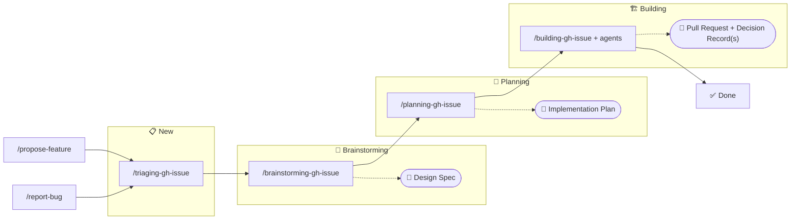

# 🪙 Token Effort

> Low-stakes intelligence for high-latency humans

A collection of OpenCode skills and agents that do just enough to avoid being replaced by a shell script.

[](https://sonarcloud.io/summary/new_code?id=HeadlessTarry_Token-Effort)

## Installation

```bash
git clone https://github.com/HeadlessTarry/Token-Effort.git
cd Token-Effort
./install.sh
```

This syncs `skills/`, `agents/`, and `plugins/` into `~/.config/opencode/`. Restart OpenCode to pick up changes.

## Directory Structure

```
skills/          → OpenCode skill definitions
agents/          → OpenCode agent definitions
pending-migration/ → Legacy Claude Code plugin content (DO NOT MODIFY — will be removed)
```

## Workflows

### Feature Development & Bug Fix Workflow



Issue states (📋 New, 🧠 Brainstorming, 📐 Planning, 🏗️ Building, ✅ Done) correspond to GitHub Project board columns. Each skill automatically advances the issue from an earlier status.

## Migration Status

This repo is migrating from a Claude Code plugin to native OpenCode skills and agents. The `pending-migration/` directory contains legacy content that will be removed once migration is complete. Do not modify or add to it.
