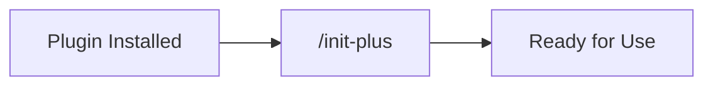
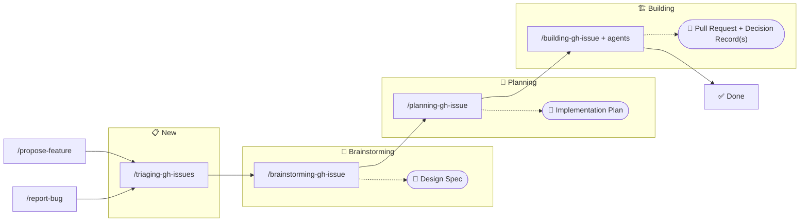

# 🪙 Token Effort

> Low-stakes intelligence for high-latency humans

A collection of Claude Code agents and skills that do just enough to avoid being replaced by a shell script.

[](https://sonarcloud.io/summary/new_code?id=HeadlessTarry_Token-Effort)

## 🚀 Getting Started

```bash
claude plugin marketplace add HeadlessTarry/Token-Effort
claude plugin install token-effort-workflow@workflow
claude plugin install token-effort-initialise@initialise
claude plugin install token-effort-labs@labs
```

After install, Claude Code will list the active plugins. You'll also need a GitHub Project board - see [github-setup.md](docs/github-setup.md) for more detail.

Skills become `/token-effort-workflow:triaging-gh-issues`, `/token-effort-initialise:init-plus`, etc.

## 📚 Documentation Index

### 🎯 Skills

| Skill | Plugin | Purpose |
|-------|--------|---------|
| [brainstorming-gh-issue](plugins/workflow/skills/brainstorming-gh-issue/SKILL.md) | workflow | Brainstorm GitHub issues, create design specs, refine ideas |
| [building-gh-issue](plugins/workflow/skills/building-gh-issue/SKILL.md) | workflow | Implement issues end-to-end from spec to merged PR |
| [computing-branch-diff](plugins/workflow/skills/computing-branch-diff/SKILL.md) | workflow | Compute changes between branches for reviews and analysis |
| [configuring-dependabot](plugins/initialise/skills/configuring-dependabot/SKILL.md) | initialise | Configure Dependabot for automated dependency updates |
| [init-plus](plugins/initialise/skills/init-plus/SKILL.md) | initialise | Interactive repository setup with CLAUDE.md and workflows |
| [move-issue-status](plugins/workflow/skills/move-issue-status/SKILL.md) | workflow | Move issues between project board statuses |
| [planning-gh-issue](plugins/workflow/skills/planning-gh-issue/SKILL.md) | workflow | Write implementation plans for approved GitHub issues |
| [propose-feature](plugins/workflow/skills/propose-feature/SKILL.md) | workflow | File new feature requests through guided interview |
| [recording-decisions](plugins/workflow/skills/recording-decisions/SKILL.md) | workflow | Record Architecture Decision Records (ADRs) in docs/decisions |
| [report-bug](plugins/workflow/skills/report-bug/SKILL.md) | workflow | File new bug reports through guided interview |
| [reviewing-code-systematically](plugins/workflow/skills/reviewing-code-systematically/SKILL.md) | workflow | Perform comprehensive code reviews on branches or main |
| [triaging-gh-issues](plugins/workflow/skills/triaging-gh-issues/SKILL.md) | workflow | Triage open issues: classify, label, and optionally advance project board status |

### 🤖 Agents

| Agent | Plugin | Purpose |
|-------|--------|---------|
| [agent-creator-engineer](plugins/labs/agents/agent-creator-engineer.md) | labs | Create new or improve existing Claude Code agent definitions |
| [reviewer-dead-code](plugins/workflow/agents/reviewer-dead-code.md) | workflow | Review files for dead code, unused symbols, and stale flags |
| [reviewer-docs](plugins/workflow/agents/reviewer-docs.md) | workflow | Review documentation for quality and accuracy |
| [reviewer-newcomer](plugins/workflow/agents/reviewer-newcomer.md) | workflow | Review source for clarity, comments, assumptions, and error message quality |
| [skill-creator-engineer](plugins/labs/agents/skill-creator-engineer.md) | labs | Create new or improve existing skill definitions |

### 🪝 Hooks

Hooks configure automation triggers in [plugins/labs/hooks/hooks.json](plugins/labs/hooks/hooks.json).

### 📊 Status Line

A custom Python statusline showing replay token load, rate limit usage, and tool errors. See [docs/status-line.md](docs/status-line.md) for installation instructions.

### Standalone Skills

The following skills are embedded within the workflows (see below) and not typically invoked directly:

- **computing-branch-diff** — Used by code review agents to compute and analyze changes between branches
- **reviewing-code-systematically** — Dispatches parallel reviewer agents to evaluate code quality and documentation

## 🔄 Workflows

Common workflows through the plugin ecosystem. Issue status labels (📋 New, 🧠 Brainstorming, 📐 Planning, 🏗️ Building, ✅ Done) correspond to GitHub Project board status columns. Each skill automatically advances the issue status on completion using `/move-issue-status`.

### Repository Initialization



### Feature Development & Bug Fix Workflow



## 🏗️ Structure

```
plugins/
├── initialise/
│   └── skills/      →  init-plus, configuring-dependabot
├── workflow/
│   ├── agents/      →  reviewer agents
│   └── skills/      →  workflow skill definitions
└── labs/
    ├── agents/      →  creator/engineer agents
    └── hooks/       →  hooks + hook declarations

.claude/skills/run-training/   →  local skill for training evals (not distributed)

training/
└── <plugin>/<type>/<name>/   →  eval cases for the /run-training skill

docs/
└── *.md             →  guides and reference docs
```

**Local vs. Plugin Skills:** Skills in `.claude/skills/` are local to this repository only and are not distributed with the plugin. Plugin skills live under `plugins/<plugin>/skills/` and are packaged for distribution.

## 🧪 Training

Skills and agents in this repo can be iteratively improved using the `/run-training` skill, which evaluates definitions against committed test cases and proposes targeted mutations to improve them.

See [docs/training-guide.md](docs/training-guide.md) for the full guide.

## 🏷️ Releases

New versions are published via the [release workflow](.github/workflows/release.yml). Trigger it manually in GitHub Actions with a SemVer version string — it patches `plugin.json`, tags the commit, and creates a GitHub release.

## ➕ Adding Things

Agents go in `plugins/labs/agents/<name>.md` (creator/engineer agents) or `plugins/workflow/agents/<name>.md` (reviewer agents). Skills go in `plugins/workflow/skills/<name>/SKILL.md` or `plugins/initialise/skills/<name>/SKILL.md` depending on their category. See existing entries for reference.
